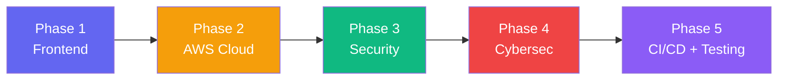

# Booktown API Platform — Master Implementation Plan

## Vision

Transform the Booktown GraphQL API from a Spring Boot lab project into a **full-stack, cloud-deployed, security-hardened** portfolio piece that demonstrates SDE + cybersecurity skills across five dimensions.



---

## Current status (Phase 1, in progress)

- ✅ **Frontend scaffolded** — Vite + React + Apollo Client in `frontend/`, with a
  vintage bookstore design system. Pages: Dashboard, Books, Authors, API Explorer, About.
- ✅ **Backend unified** — the two lab projects were consolidated into a single tracked
  `backend/` (Spring Boot GraphQL + JPA/H2), built from Activity 2, which is a functional
  superset of Activity 1. `Activity1/`/`Activity2/` are deprecated and slated for removal.
- ✅ **End-to-end verified** — `frontend` (`:5173`) proxies `/graphql` to `backend` (`:8080`).

## Phase 1 — Frontend

Build a modern, visually impressive React frontend that showcases the API.

### Tech Stack

| Technology | Why |
|---|---|
| **Vite + React** | Fast dev server, modern tooling, industry standard |
| **Vanilla CSS** (custom design system) | Full control, no framework bloat |
| **Apollo Client** | Best-in-class GraphQL client for React |
| **Framer Motion** | Smooth micro-animations |
| **Google Fonts (Inter)** | Clean, modern typography |

### Pages & Features

#### 1. Landing / Dashboard
- Hero section with project stats (total books, authors, recent activity)
- Animated card grid of featured books
- Dark mode by default with glassmorphism cards
- Smooth page transitions

#### 2. Books Page
- Searchable, filterable book catalog
- Search-by-title with live substring matching (uses `booksByTitleSubstring`)
- Click a book → detail view with author info
- Add / Delete book modals (mutations)

#### 3. Authors Page
- Author cards with book count badges
- Filter by last name (uses `authorsByLastName`)
- Click author → see all their books (uses `booksByAuthorId`)
- Edit last name inline (uses `updateAuthorLastName`)
- "Books by first name" search (uses `bookTitlesByAuthorFirstName`)

#### 4. API Explorer / Playground
- Embedded GraphiQL or custom query runner
- Pre-loaded example queries users can click to run
- Shows the raw JSON response — demonstrates the API to recruiters

#### 5. About / Architecture
- Visual architecture diagram (Mermaid or image)
- Tech stack badges
- Link to GitHub repo

### Project Structure (Frontend)

```
BooktownAPI_Platform/
├── README.md
├── backend/                     ← Unified Spring Boot GraphQL API (JPA + H2), tracked
├── frontend/                    ← Vite + React + Apollo, tracked
│   ├── package.json
│   ├── vite.config.js
│   ├── index.html
│   ├── public/
│   └── src/
│       ├── main.jsx
│       ├── App.jsx
│       ├── index.css            ← Design system (vintage bookstore)
│       ├── apollo/              ← Apollo client
│       ├── graphql/             ← Queries & mutations
│       ├── components/          ← Reusable UI components
│       └── pages/               ← Page components
├── Activity1/                   ← Deprecated lab v1 (git-ignored, to be removed)
└── Activity2/                   ← Deprecated lab v2 (git-ignored, to be removed)
```

> [!IMPORTANT]
> `backend/` and `frontend/` live in the **root repo** and are tracked. The frontend
> proxies API requests to the Spring Boot backend on `localhost:8080` during development.

### Design Direction

- **Dark mode primary** — deep navy/charcoal background (#0f172a)
- **Accent gradient** — indigo → violet (#6366f1 → #8b5cf6)
- **Glassmorphism** cards with subtle backdrop blur
- **Micro-animations** on hover, page transitions, loading states
- **Responsive** — works on desktop and mobile

---

## Phase 2 — AWS Cloud (After Frontend)

| Component | AWS Service |
|---|---|
| Compute | EC2 (t2.micro, free tier) |
| Database | RDS PostgreSQL (replace H2) |
| Load Balancer | ALB |
| Static Assets | S3 + CloudFront (for frontend) |
| Secrets | Secrets Manager |
| IAM | Scoped roles for EC2 → RDS/S3 |

---

## Phase 3 — Security Hardening

- Spring Security + JWT authentication
- Role-based access control on mutations (read = public, write = authenticated)
- Query depth limiting (prevent DoS via nested queries)
- Disable introspection in production
- Rate limiting

---

## Phase 4 — Cybersecurity

- OWASP ZAP automated scan against deployed API
- Fix findings and document remediation
- AWS WAF rules on ALB
- CloudWatch alerting for suspicious traffic
- Security findings write-up

---

## Phase 5 — CI/CD + Testing

- GitHub Actions: test → build → deploy
- JUnit 5 integration tests with JaCoCo coverage
- Coverage reports stored in S3
- Auto-deploy on push to main

---

## Decisions (resolved)

1. **Stack:** Vite + React + Apollo Client.
2. **Backend:** unified `backend/` (JPA/H2), consolidated from Activity 1 + 2.
3. **Tracking:** `frontend/` and `backend/` are tracked in the root repo.
4. **Design:** warm bookstore / vintage — cream & paper, serif headings, amber accents.

## Immediate Next Step

- Remove the deprecated `Activity1/` and `Activity2/` directories.
- Commit `backend/`, `frontend/`, and the updated docs.
- Polish Phase 1 UI, then begin Phase 2 (AWS).
