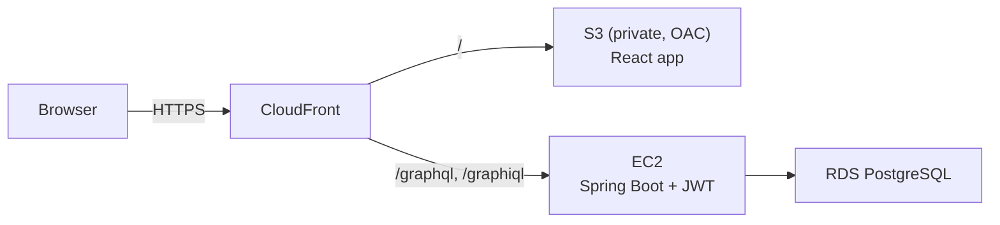

# 📚 Booktown API Platform

[](https://github.com/HiteshKolluru/BooktownAPI_Platform/actions/workflows/ci.yml)
&nbsp;**Live demo → https://d2jp9hcegs2w8v.cloudfront.net**

A GraphQL bookstore app: a **React** storefront over a **Spring Boot GraphQL API**, backed
by **PostgreSQL** and deployed on **AWS**. Browse and search books and authors; admins sign
in to add, edit, and delete catalog entries.

## Features

- **Browse & search** — books and authors, with live title search and author filters
- **Author ↔ book relationships** — view an author's catalog, find titles by author name
- **Admin CRUD** — add/edit/delete books and authors (JWT-protected; reads are public)
- **API Explorer** — run live GraphQL queries from the UI, or use the built-in GraphiQL IDE
- **Secured by default** — JWT auth, role-based writes, rate limiting, query-depth limits,
  HTTPS + security headers at the edge (see [SECURITY.md](SECURITY.md))

## Architecture



One CloudFront domain serves both the app and the API, so it's all HTTPS and same-origin
(the frontend just calls `/graphql`).

## Tech stack

| Layer | Tech |
|---|---|
| Frontend | React, Vite, Apollo Client, Framer Motion |
| Backend | Java 17, Spring Boot 3, Spring for GraphQL, Spring Security (JWT), Spring Data JPA |
| Database | PostgreSQL (prod) · H2 (local dev) |
| Infra / CI | AWS (EC2, RDS, S3, CloudFront, CloudWatch) · GitHub Actions |

## GraphQL API

Schema: [`backend/src/main/resources/graphql/schema.graphqls`](backend/src/main/resources/graphql/schema.graphqls)

**Queries (public):** `authors`, `authorById(id)`, `books`, `bookByISBN(isbn)`,
`booksByAuthorId(authorId)`, `booksByTitleSubstring(substring)`, `authorsByLastName(lastName)`,
`bookTitlesByAuthorFirstName(firstName)`

**Mutations:** `login(input)` (public, returns a JWT); admin-only `addBook`, `deleteBook`,
`addAuthor`, `updateAuthorLastName`.

```graphql
# get a token, then send it as: Authorization: Bearer <token>
mutation { login(input: { username: "admin", password: "••••" }) { token } }
mutation { addBook(input: { isbn: "123", title: "Dune", authorId: 1 }) { book { isbn title } } }
```

## Running locally

**Prerequisites:** JDK 17+, Node 18+ (the backend ships the Gradle wrapper).

```bash
# Terminal 1 — API (in-memory H2, default admin/admin)
cd backend && ./gradlew bootRun          # http://localhost:8080

# Terminal 2 — frontend
cd frontend && npm install && npm run dev # http://localhost:5173
```

The dev server proxies `/graphql`, `/graphiql`, and `/h2-console` to the backend. Run tests
with coverage: `cd backend && ./gradlew test jacocoTestReport`.

## Repository layout

```
backend/    Spring Boot GraphQL API (JPA, JWT security)
frontend/   Vite + React + Apollo storefront
SECURITY.md security overview & findings
```
