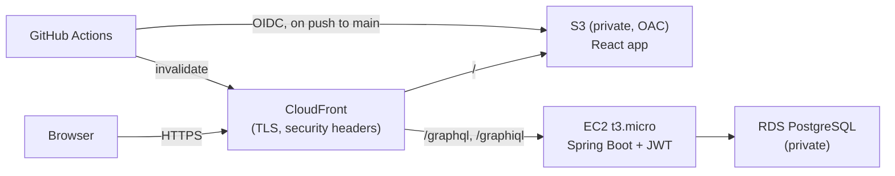

# 📚 Booktown API Platform

[](https://github.com/HiteshKolluru/BooktownAPI_Platform/actions/workflows/ci.yml)
&nbsp;**Live demo → https://d2jp9hcegs2w8v.cloudfront.net**

A full-stack, cloud-deployed, security-hardened **GraphQL bookstore** — a React storefront
over a Spring Boot GraphQL API, running on AWS with JWT auth, edge security, monitoring,
and a CI/CD pipeline.

It began as an ASU SER421 GraphQL lab and was grown across five phases into a portfolio
piece demonstrating **SDE + cloud + cybersecurity** skills end-to-end.

---

## Architecture



One CloudFront domain serves **both** the app and the API, so everything is HTTPS and
**same-origin** (no CORS). The API port and database are reachable only from CloudFront and
the app respectively; SSH is locked to the admin IP.

---

## Tech stack

| Layer | Tech |
|---|---|
| **Frontend** | React, Vite, Apollo Client, Framer Motion, vanilla-CSS design system |
| **Backend** | Java 17, Spring Boot 3, Spring for GraphQL, Spring Security (JWT), Spring Data JPA |
| **Database** | PostgreSQL (AWS RDS) in prod · H2 in local dev |
| **Cloud** | EC2, RDS, S3, CloudFront, IAM, CloudWatch, SNS (us-east-1) |
| **CI/CD** | GitHub Actions, JaCoCo, GitHub OIDC → IAM |
| **Security tooling** | OWASP ZAP, AWS managed prefix lists, CloudFront response-headers policy |

---

## What's inside (the 5 phases)

1. **Frontend** — React storefront with a vintage-bookstore aesthetic: Dashboard, Books
   (search + add/delete), Authors (filter, add, edit, titles-by-first-name), a live API
   Explorer, and an About/architecture page.
2. **AWS cloud** — EC2 (Spring Boot via systemd) + RDS PostgreSQL + S3/CloudFront for the
   SPA, Elastic IP for stability, least-privilege security groups.
3. **Security** — Spring Security + JWT (admin login), role-based access (reads public,
   writes admin-only), GraphQL query-depth limiting, per-IP rate limiting, introspection
   disabled in prod.
4. **Cybersecurity** — OWASP ZAP scan, CloudFront security headers (CSP, HSTS, etc.),
   CloudWatch alarms + SNS alerting. See [SECURITY.md](SECURITY.md).
5. **CI/CD** — GitHub Actions builds + tests (JUnit 5 + JaCoCo) on every push/PR, and
   auto-deploys the frontend to S3 + CloudFront on `main` via GitHub OIDC (no stored keys).

---

## GraphQL API

Schema: [`backend/src/main/resources/graphql/schema.graphqls`](backend/src/main/resources/graphql/schema.graphqls)

**Queries (public):** `authors`, `authorById(id)`, `books`, `bookByISBN(isbn)`,
`booksByAuthorId(authorId)`, `booksByTitleSubstring(substring)`, `authorsByLastName(lastName)`,
`bookTitlesByAuthorFirstName(firstName)`

**Mutations:** `login(input)` *(public — returns a JWT)*; and admin-only
`addAuthor`, `addBook`, `updateAuthorLastName`, `deleteBook`.

```graphql
# 1) get a token
mutation { login(input: { username: "admin", password: "••••" }) { token } }

# 2) call a protected mutation with header: Authorization: Bearer <token>
mutation { addBook(input: { isbn: "123", title: "Dune", authorId: 1 }) { book { isbn title } } }
```

---

## Run it locally

**Prerequisites:** JDK 17+, Node 18+. (Backend ships the Gradle wrapper.)

```bash
# Terminal 1 — API (in-memory H2, default admin/admin)
cd backend && ./gradlew bootRun          # http://localhost:8080

# Terminal 2 — frontend
cd frontend && npm install && npm run dev # http://localhost:5173
```

The Vite dev server proxies `/graphql`, `/graphiql`, `/h2-console` to the backend, so the
app calls a same-origin `/graphql`. Useful endpoints: `/graphiql` (IDE), `/h2-console`
(JDBC `jdbc:h2:mem:booktowndb`, user `sa`, no password).

Run the tests + coverage:

```bash
cd backend && ./gradlew test jacocoTestReport   # report: build/reports/jacoco/test/html
```

---

## Repository layout

```
BooktownAPI_Platform/
├── .github/workflows/ci.yml   # CI/CD pipeline (test + coverage, frontend auto-deploy)
├── backend/                   # Spring Boot GraphQL API (JPA, JWT security)
├── frontend/                  # Vite + React + Apollo storefront
├── SECURITY.md                # Phase 4 security findings & remediation
├── IMPLEMENTATION_PLAN.md     # 5-phase roadmap & vision
├── CLAUDE.md                  # contributor/agent guidance
└── README.md
```

---

## Notes

- Local dev uses in-memory H2 (data resets on restart, re-seeded automatically); production
  uses persistent RDS PostgreSQL via the `prod` Spring profile (env-var driven).
- All secrets (DB / admin passwords, JWT signing key) live in host environment variables or
  are obtained via GitHub OIDC — none are committed to the repo.
